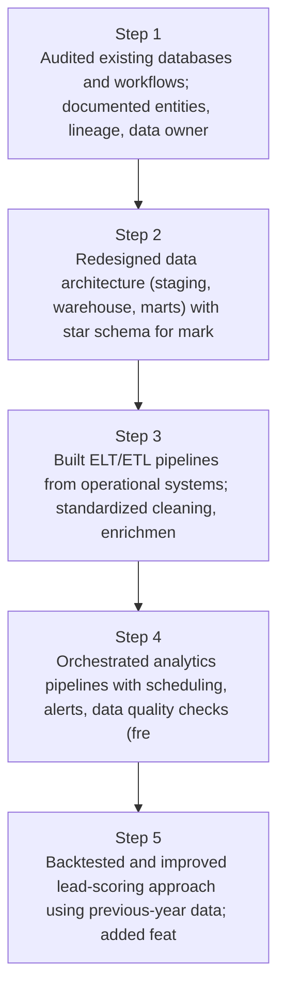
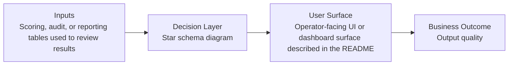

# Unified Analytics & Lead Growth Diagrams

Generated on 2026-04-26T04:29:37Z from README narrative plus project blueprint requirements.

## Data architecture (staging → warehouse → marts)

## Star schema diagram

## Evidence Gap Map

